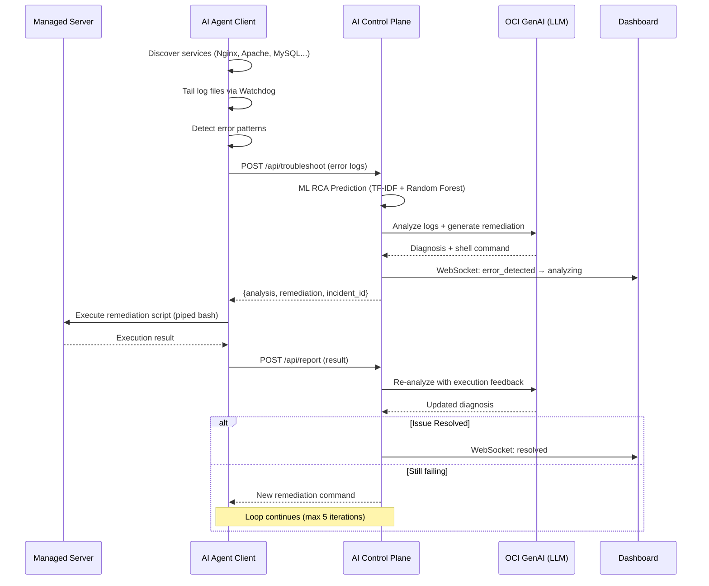

# Web Server Troubleshooting Agent

An **AI-driven, autonomous system** for detecting, diagnosing, and remediating web-server issues in real time. Combines endpoint sensor agents, a cloud-hosted AI brain powered by **Oracle Cloud Infrastructure (OCI) Generative AI**, machine-learning root-cause analysis, and live monitoring dashboards into a unified AIOps platform.

---

## System Architecture

```
                        ┌─────────────────────────────┐
                        │      AI Control Plane       │
                        │         (OCI Server)        │
                        │                             │
                        │  FastAPI + LangGraph + LLM  │
                        │  ML RCA  │ Anomaly Detect   │
                        │  SQLite  │ WebSocket Events │
                        └──────┬──────────┬───────────┘
                               │          │
                ┌──────────────┘          └──────────────┐
                │                                        │
     ┌──────────▼──────────┐              ┌──────────────▼──────────┐
     │   Admin Dashboard   │              │  Managed Server(s)      │
     │   (ai_dashboard)    │              │                         │
     │                     │              │  ┌───────────────────┐  │
     │  Next.js at /       │              │  │ AI Agent Client   │  │
     │  Full system view   │              │  │ (Python daemon)   │  │
     │                     │              │  │ Discovery, Logs,  │  │
     └─────────────────────┘              │  │ UX, DR, Remediate │  │
                                          │  └───────────────────┘  │
                                          │  ┌───────────────────┐  │
                                          │  │ Console Dashboard │  │
                                          │  │ (ai_dashboard_    │  │
                                          │  │  console)         │  │
                                          │  │ Next.js at        │  │
                                          │  │ /troubleshoot     │  │
                                          │  └───────────────────┘  │
                                          └─────────────────────────┘
```

---

## Components

| Component | Description | Tech Stack |
|---|---|---|
| [**ai_control_plane**](https://github.com/Damilarondo/ai_control_plane) | Central AIOps brain — API, AI agentic loop, ML engines, auth, real-time events | Python, FastAPI, LangGraph, OCI GenAI, Scikit-Learn, SQLite |
| [**ai_agent_client**](https://github.com/Damilarondo/ai_agent_client) | Endpoint sensor agent — discovers services, tails logs, runs UX checks, executes remediation | Python, Watchdog, Playwright, Psutil |
| [**ai_dashboard**](https://github.com/Damilarondo/ai_dashboard) | Admin monitoring dashboard — full system visibility and operational controls | Next.js 16, TypeScript, Tailwind CSS, WebSocket |
| [**ai_dashboard_console**](https://github.com/Damilarondo/ai_dashboard_console) | Managed server console — tenant-scoped view auto-deployed on each managed server | Next.js 16, TypeScript, Tailwind CSS, WebSocket |

---

## How It Works



---

## Quick Start

### 1. Deploy the Control Plane (OCI Server)

```bash
git clone https://github.com/Damilarondo/ai_control_plane.git
cd ai_control_plane
python3 -m venv venv && source venv/bin/activate
pip install -r requirements.txt

# Train the ML model
python generate_dataset.py
python train_rca_model.py

# Set required environment variables
export OCI_COMPARTMENT_ID=<your-oci-compartment-id>
export JWT_SECRET_KEY=<a-strong-secret-key>

# Start the server
python main.py
```

### 2. Install an Agent on a Managed Server

```bash
curl -sSL https://<control-plane-host>/install.sh | bash
```

The installer will prompt for dashboard credentials, register with the control plane, install the agent as a systemd service, and set up the `/troubleshoot` console dashboard.

### 3. Launch the Admin Dashboard

```bash
git clone https://github.com/Damilarondo/ai_dashboard.git
cd ai_dashboard
npm install
NEXT_PUBLIC_API_URL=https://<control-plane-host> npm run dev
```

---

## Key Technologies

| Layer | Technology |
|---|---|
| **LLM** | OCI Generative AI — Cohere Command R+ (via LangChain OCI) |
| **Agentic Framework** | LangGraph (ReAct loop: Analyze → Remediate → Report → Re-Analyze) |
| **ML — Root Cause** | TF-IDF + Random Forest (Scikit-Learn) |
| **ML — Anomaly Detection** | Isolation Forest (Scikit-Learn) + OCI Anomaly Detection Service |
| **Backend** | FastAPI + Uvicorn (Python) |
| **Database** | SQLite with WAL mode |
| **Frontend** | Next.js 16, React 19, TypeScript, Tailwind CSS 4 |
| **Real-Time** | WebSocket (tenant-scoped event broadcasting) |
| **Monitoring** | Watchdog (file system), Psutil (system metrics), Playwright (UX) |
| **Security** | Bcrypt, JWT, command allowlist, regex blocklist, CORS, rate limiting |

---

## License

This project is part of a Final Year Project at the University of Lagos.
